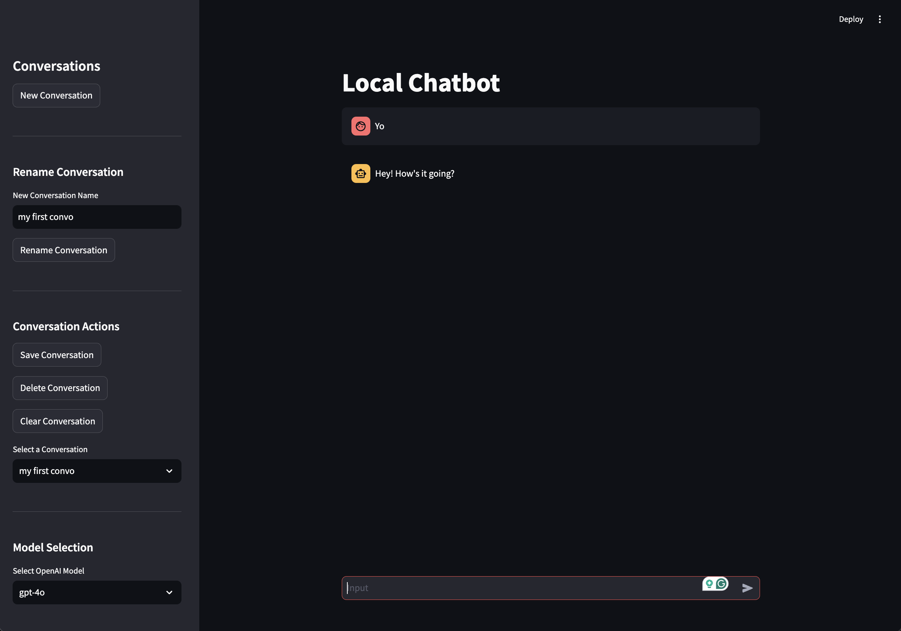
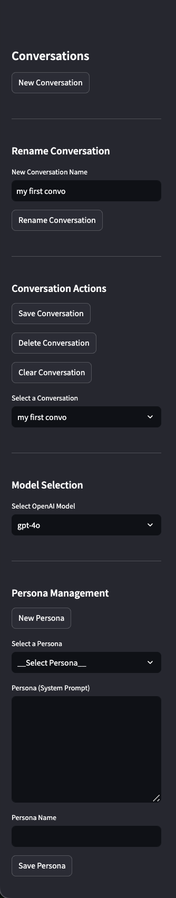

# Chat Streamlit Interface

A Streamlit-based interface for AI Chat that supports multiple conversations, personas, and different OpenAI models. Giving you a chat history + privacy that comes from using the API

## Features

- Multiple conversation management
- Persona creation and management
- Support for different OpenAI models
- Conversation renaming and deletion
- Persistent storage of conversations and personas

## Demo images


*Main chat interface with conversation management sidebar*


## Installation

<!-- TODO: Complete setup and usage instructions -->
1. Clone the repository:

```bash
git clone https://github.com/yourusername/chat-streamlit.git
cd chat-streamlit
```

2. Install the dependencies:

```bash
pip install .
```


3. Create a `.env` file in the root directory and add your OpenAI API key:

```bash
OPENAI_API_KEY=your_openai_api_key
```

4. Run the app:

```bash
streamlit run app.py
```

## Usage

### Configuration

You can configure the following settings in `config.py`:

- Default model version
- Conversation storage location
- Personas file location

## Contributing

Just submit feature requests or a PR! as long as it stays as simple as it is.

## License

This project is licensed under the MIT License - see the [LICENSE](LICENSE) file for details.


## More features on the sidebar



*Sidebar with conversation management, persona creation, and model selection*